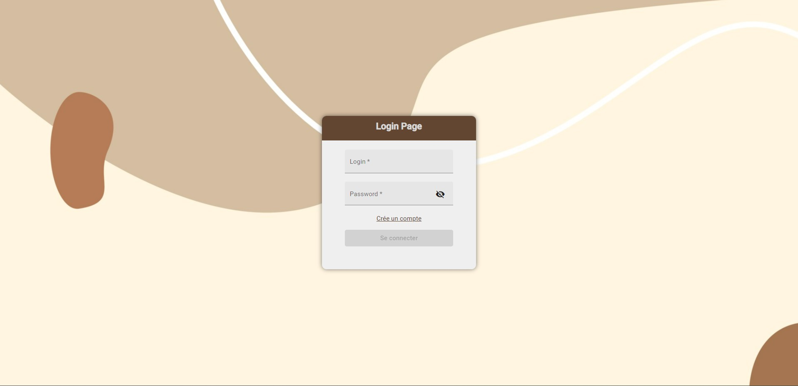
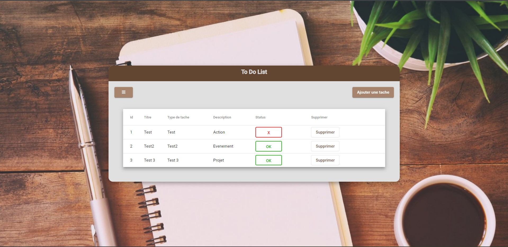

# ToDoListSite
ToDoListSite est une application frontend développée avec Angular et TypeScript, qui permet aux utilisateurs de gérer leur liste de tâches à accomplir et de gérer leurs comptes d'utilisateurs.

# Fonctionnalités :
 - Se connecter : Les utilisateurs peuvent se connecter à leur compte.
 - Se déconnecter : Les utilisateurs peuvent se déconnecter de leur compte.
 - Créer un compte : Les utilisateurs peuvent créer un nouveau compte utilisateur.
 - Supprimer un compte : Les utilisateurs peuvent supprimer leur compte utilisateur.
 - Modifier un compte : Les utilisateurs peuvent modifier les informations de leur compte utilisateur.
 

 - Créer une To-Do : Les utilisateurs peuvent ajouter un nouveau To-Do à leur liste.
 - Sélectionner tous les To-Do : Les utilisateurs peuvent afficher tous les To-Do de leur liste.
 - Sélectionner les To-Do par utilisateur connecté : Les utilisateurs peuvent afficher les To-Do de leur liste correspondant à leur compte utilisateur.
 - Modifier une To-Do : Les utilisateurs peuvent modifier une To-Do existante de leur liste.
 - Supprimer une To-Do : Les utilisateurs peuvent supprimer une To-Do existante de leur liste.

# Installation :
Cloner le repository sur votre machine.
Assurez-vous d'avoir Angular et TypeScript installés sur votre machine.
Exécutez la commande npm install pour installer toutes les dépendances nécessaires.
Exécutez la commande ng serve pour lancer l'application.
